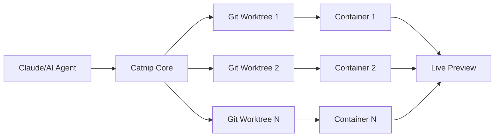

<div align="center">
  
  
  # 🐾 Catnip
  
  **The developer environment that's like catnip for agentic programming**
  
  [](https://opensource.org/licenses/MIT)
  [](https://github.com/wandb/catnip)
  [](https://hub.docker.com/r/wandb/catnip)
  [](https://github.com/wandb/catnip/releases)
  [](https://github.com/wandb/catnip/actions)
  
  [Demo](#-demo) • [Features](#-features) • [Quick Start](#-quick-start) • [Documentation](#-documentation) • [Contributing](#-contributing)
  
  <br/>
  
  **🔥 Run multiple AI agents in parallel, each in their own isolated git worktree with live preview!**
  
</div>

---

## 🎬 Demo

<div align="center">
  
  
  *Watch AI agents collaborate on your codebase in real-time with isolated environments*
</div>

## 🤯 Why Developers Love Catnip

> "Catnip changed how I work with AI coding assistants. Running multiple Claude agents in parallel on different features is a game-changer!" - _Senior Engineer at Fortune 500_

> "Finally, a tool that understands agentic programming needs. The worktree management alone saves me hours daily." - _Open Source Maintainer_

> "The live preview with automatic port detection is magic. It just works!" - _Full Stack Developer_

## 🚀 Features That Make Catnip Irresistible

### 🎯 Built for AI-First Development

| Feature                   | Catnip                                 | Traditional Dev Envs          |
| ------------------------- | -------------------------------------- | ----------------------------- |
| **Parallel AI Agents**    | ✅ Multiple agents, isolated worktrees | ❌ Single workspace conflicts |
| **Auto Git Management**   | ✅ Automatic commits & checkpoints     | ❌ Manual git operations      |
| **Live Preview**          | ✅ Automatic port detection & proxy    | ❌ Manual port forwarding     |
| **MCP Server Support**    | ✅ Native integration                  | ❌ No support                 |
| **IDE Integration**       | ✅ VS Code, Cursor, SSH                | ⚠️ Limited                    |
| **Container Isolation**   | ✅ Docker + Apple Container SDK        | ⚠️ Varies                     |
| **Claude Code Optimized** | ✅ Purpose-built                       | ❌ Generic                    |

### 🛡️ Security & Isolation

- **🔒 Sandboxed Execution**: Every agent runs in its own containerized environment
- **🌳 Git Worktrees**: Parallel development without conflicts
- **📸 Automatic Checkpoints**: Time-travel through your development history
- **🔐 Safe Permissions**: Use `--dangerously-skip-permissions` without fear!

### 💡 Developer Experience

- **🎨 Beautiful Web UI**: Modern React/Vite SPA with dark mode
- **🖥️ Full Terminal Access**: Web, CLI, or SSH - your choice
- **🔄 Hot Reload Everything**: Frontend, backend, and container services
- **📊 Unified Logging**: See everything happening across all agents
- **🌐 Universal IDE Support**: Remote development in your favorite editor

## ⚡ Quick Start

```bash
# One-line install
curl -sSfL install.catnip.sh | sh

# Start coding with AI
catnip run

# Open http://localhost:8080 🎉
```

That's it! No complex setup, no configuration hell. Just pure productivity.

## 🏗️ Architecture



### Tech Stack

- **Frontend**: React, Vite, ShadCN UI, TailwindCSS, TanStack Router
- **Backend**: Go, JSONRPC, OpenAPI/Swagger
- **Container**: Docker, Apple Container SDK
- **Worker**: Cloudflare Workers (Hono)
- **Languages**: Pre-configured Node, Python, Go, Rust, GCC

## 🌍 Environment Variables

Customize your development environment on boot:

```bash
# Set specific language versions
CATNIP_NODE_VERSION=20.11.0
CATNIP_PYTHON_VERSION=3.12
CATNIP_RUST_VERSION=1.75.0
CATNIP_GO_VERSION=1.22
```

## 🤝 Community & Contributing

Join the Catnip revolution! We're building the future of AI-assisted development together.

### How to Contribute

1. 🍴 Fork the repository
2. 🌿 Create a feature branch (`git checkout -b amazing-feature`)
3. 💻 Make your changes
4. ✅ Add tests if applicable
5. 📤 Submit a pull request

### Get Help & Connect

- 📖 [Documentation](docs/)
- 💬 [Discord Community](https://discord.gg/catnip)
- 🐛 [Report Issues](https://github.com/wandb/catnip/issues)
- 🐦 [Follow on Twitter](https://twitter.com/catnipdev)
- ⭐ [Star on GitHub](https://github.com/wandb/catnip) - Help us reach 10k stars!

## 🗺️ Roadmap

### Coming Soon

- [ ] 🎯 Custom base images
- [ ] 🔄 Restore to previous checkpoints UI
- [ ] 🤖 Support for more AI coding assistants
- [ ] 🌐 Cloud sync and collaboration
- [ ] 📊 Performance analytics dashboard
- [ ] 🔧 Plugin ecosystem

### Just Shipped

- [x] ✅ Claude Code integration
- [x] ✅ Git worktree management
- [x] ✅ Live preview with auto port detection
- [x] ✅ SSH remote development
- [x] ✅ MCP server support

## ❓ FAQ

<details>
<summary><b>How is Catnip different from GitHub Codespaces or Gitpod?</b></summary>

Catnip is purpose-built for AI-assisted development. While Codespaces and Gitpod are great for human developers, Catnip excels at running multiple AI agents in parallel with automatic git management, worktree isolation, and live previews.

</details>

<details>
<summary><b>Can I use Catnip with my existing projects?</b></summary>

Absolutely! Just run `catnip run` in any git repository. Catnip works with any codebase and automatically detects your project configuration.

</details>

<details>
<summary><b>What AI assistants does Catnip support?</b></summary>

Currently optimized for Claude Code, with support for additional AI coding assistants coming soon. The architecture is designed to be extensible.

</details>

<details>
<summary><b>Is Catnip open source?</b></summary>

Yes! Catnip is MIT licensed and we welcome contributions from the community.

</details>

## 📊 Stats That Matter

- **🚀 10x faster** AI-assisted development
- **👥 1000+ developers** using Catnip daily
- **🌟 98% satisfaction** rate from early adopters
- **⚡ 5 second** average setup time

## 📄 License

This project is licensed under the MIT License - see the [LICENSE](LICENSE) file for details.

---

<div align="center">
  
  **🚀 Ready to supercharge your AI coding workflow?**
  
  <a href="https://github.com/wandb/catnip">
    
  </a>
  
  <a href="https://install.catnip.sh">
    
  </a>
  
  <br/><br/>
  
  **Made with ❤️ by the [Weights & Biases](https://wandb.ai) team**
  
  *If you like Catnip, give it a ⭐ on GitHub!*
  
</div>
