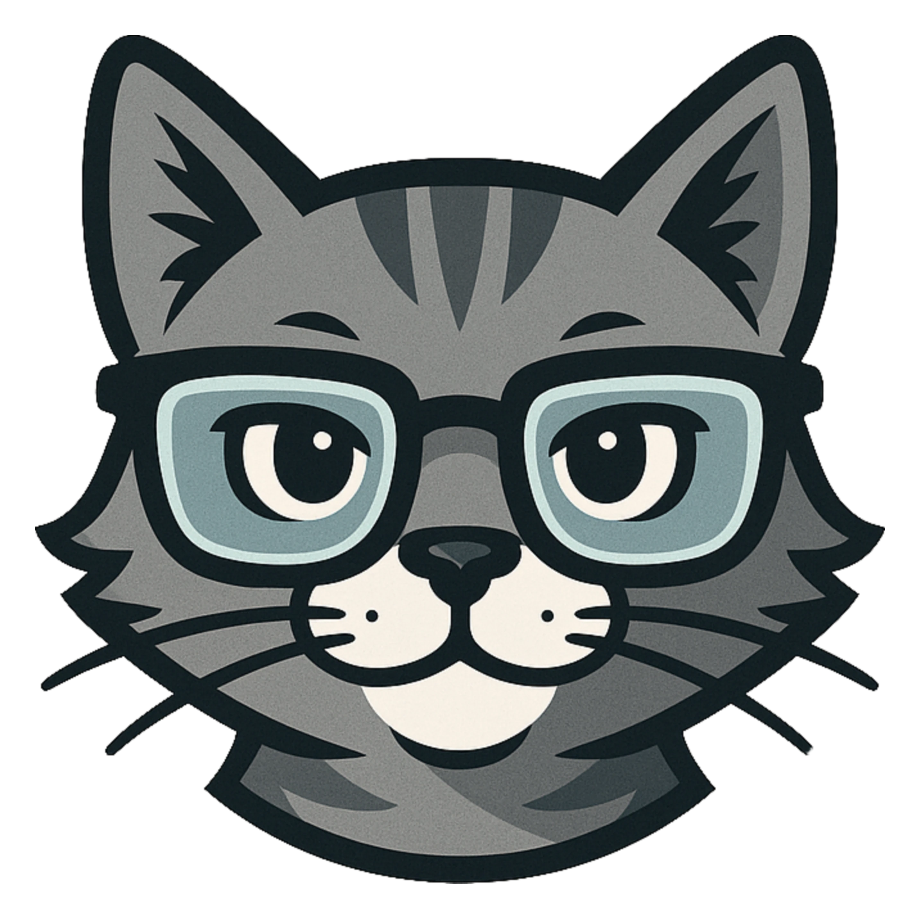
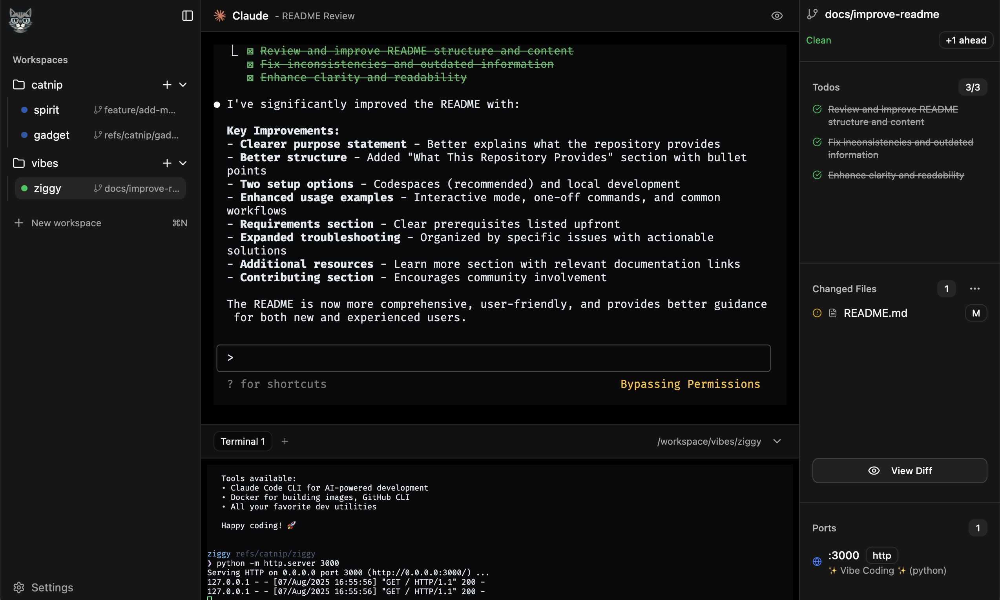
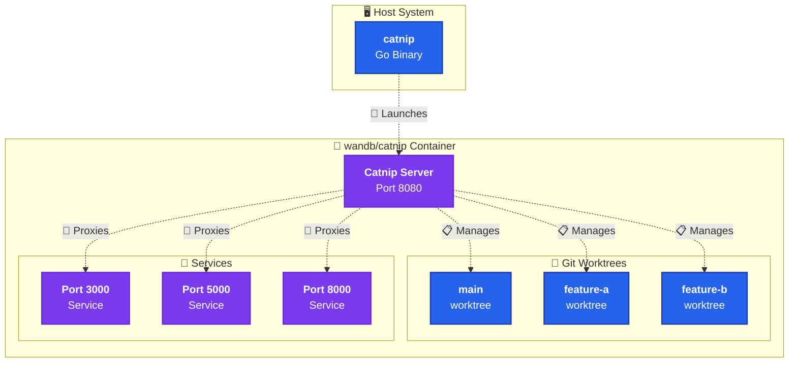

<div align="center">
  

# 🐾 Catnip

**The developer environment that's like catnip for agentic programming**

[](https://github.com/wandb/catnip)
[](https://hub.docker.com/r/wandb/catnip)
[](https://github.com/wandb/catnip/releases)
<br/>

**🔥 Run multiple AI agents in parallel, each in their own isolated git worktree with live preview!**



</div>

## 🚀 Why Catnip?

Catnip's purpose is to make developing with AI more accessible and productive.

- **🔒 Isolated Sandbox**: All code runs containerized environment using either Docker or Apple's new [Container SDK](https://github.com/apple/container). We can use --dangerously-skip-permissions without fear!
- **🧑‍💻 Worktree Management**: Worktree's let you spawn multiple agents in parallel. Catnip keeps everything organized.
- **💻 Full Terminal Access**: Open multiple terminals via the web interface, CLI, or directly via SSH.
- **👀 Preview Changes**: Catnip has a built in proxy and port detection. Start a web service and preview it live!
- **🌐 Universal Access**: Still a big fan of Cursor or VS Code? No problem, full remote development directly in your IDE is supported.

## ⚡ Quick Start

```bash
curl -sSfL install.catnip.sh | sh
catnip run
# Open http://localhost:8080 🎉
```

## 🤓 How it works



`catnip` is a golang binary with a vite SPA embedded within it. The `wandb/catnip` container was inspired by the [openai/codex-universal](https://github.com/openai/codex-universal) container.

It comes pre-configured with node, python, golang, gcc, and rust. You can have the container install a different version of the language on boot by setting any of these environment variables:

```bash
# Set specific language versions
CATNIP_NODE_VERSION=20.11.0
CATNIP_PYTHON_VERSION=3.12
CATNIP_RUST_VERSION=1.75.0
CATNIP_GO_VERSION=1.22
```

> [!NOTE]
> In the future we intend to support custom base images.

### Environment Setup

Catnip currently looks for a file named `setup.sh` in the root of your repo and runs it when a workspace is created. This is a great place to run `pnpm install` or `uv sync` etc.

### SSH

The `catnip run` command configures SSH within the container by default. It creates a key pair named `catnip_remote` and configures a `catnip` host allowing you to run `ssh catnip` or open a remote development environment via the [Remote-SSH extension](https://marketplace.cursorapi.com/items/?itemName=anysphere.remote-ssh).

### Git

If you run `catnip` from within a git repo, we mount the repo into the container and create a default workspace. When you start a claude session in Catnip the system automatically commits changes as claude makes them.

> [!TIP]
> The workspace within the container is committing to a custom ref `refs/catnip/$NAME`. For convenience we also create a nicely named branch like `feature/make-something-great`. This branch is kept in sync with the workspace ref which means you can run `git checkout feature/make-something-great` outside of the container to see changes locally!

### Ports

Catnip detects any ports that are bound within the container. Each workspace also has the `PORT` environment variable set to a known free port. When a port is opened we notify you in the UI and make the port accessible at `http://localhost:8080/$PORT`. Your application should not need to know it's running under a sub-path. We do a bunch of hacky stuff to make links and fetch request do the right thing.

> [!CAUTION]
> We're doing some terrible hacky awful stuff to make our proxy work currently. It's likely brittle and may miss more complex scenarios. If you're having issues with our proxy, you can forward ports directly to your host with ssh `ssh -L 3000:localhost:3000 catnip` or use the built in port forwarding of VSCode or Cursor.

## 🗺️ Roadmap

### Coming Soon

- [ ] 🎯 Custom base images
- [ ] 🔄 Restore to previous checkpoints
- [ ] 🤖 Support for more AI coding assistants
- [ ] 🌐 Cloud based deployments
- [ ] 🔧 Plugin ecosystem

## ❓ FAQ

<details>
<summary><b>How is Catnip different from Jules, Open SWE, or Conductor</b></summary>
Catnip is Open Source, built to be extensible, and prioritizes local development first with support for cloud based deployments on the roadmap.
</details>
<details>
<summary><b>What AI assistants does Catnip support?</b></summary>

Currently optimized for Claude Code, with support for additional AI coding assistants likely coming soon. The architecture is designed to be extensible.

</details>
<details>
<summary><b>Did you develop Catnip with Catnip?</b></summary>
Big time... Inception 🤯
</details>

## 🤝 Contributing

We welcome contributions! Catnip is designed to make agentic programming more powerful and accessible.

1. 🍴 Fork the repository
2. 🌿 Run catnip in dev mode `catnip run --dev`
3. 💻 Make your changes
4. ✅ Add tests if applicable
5. 📤 Submit a pull request

## 📄 License

This project is licensed under the Apache 2.0 - see the [LICENSE](LICENSE) file for details.

---

<div align="center">

**Made with ❤️ by the [Weights & Biases](https://wandb.ai) team**
<br/> <a href="https://github.com/wandb/catnip">

</a>

</div>
