<div align="center">
  

# 🐾 Catnip

**The developer environment that's like catnip for agentic programming.**

**🎯 Perfect for**: Building LLM applications, agentic systems, or any project where you want multiple AI coding assistants working in parallel without stepping on each other's toes.

[](https://github.com/wandb/catnip)
[](https://hub.docker.com/r/wandb/catnip)
[](https://github.com/wandb/catnip/releases)
<br/>

**🔥 Parallel vibe coding in containers. Stay organized, get notified, create anything! 😎**


</div>

## 💡 When to Use Catnip

**You should use Catnip if you:**

- Build LLM applications (chatbots, RAG systems, AI agents) and want AI assistants to help code different parts simultaneously
- Use Claude Code (or plan to) but wish you could run multiple sessions on different features without Git conflicts
- Want a safe, isolated environment where AI assistants can run terminal commands without risking your main system
- Build full-stack applications and need multiple services (API, frontend, database) running with automatic port management
- Work on complex projects and want AI assistants to collaborate on different components in parallel

## 🚀 Why Catnip?

Think of Catnip as a **multi-agent coding workspace** that solves the chaos of having AI assistants work together on complex projects.

**The Problem:** You want Claude Code (or other AI assistants) to help build your LLM app, but:

- You can't run multiple Claude sessions on the same project (Git checkout conflicts)
- AI assistants might break your main development environment
- Managing different services (API, frontend, database) manually is tedious
- You lose track of what each AI assistant is working on

**The Solution:** Catnip gives each AI assistant its own isolated workspace while keeping everything synchronized:

- **🔒 Isolated Sandbox**: All code runs containerized environment using either Docker or Apple's new [Container SDK]
  (https://github.com/apple/container). We can use --dangerously-skip-permissions without fear!
- **🧑‍💻 Worktree Management**: Worktree's let you spawn multiple agents in parallel. Catnip keeps everything organized.
- **💻 Full Terminal Access**: Open multiple terminals via the web interface, CLI, or directly via SSH.
- **👀 Preview Changes**: Catnip has a built in proxy and port detection. Start a web service and preview it live!
- **🌐 Universal Access**: Still a big fan of Cursor or VS Code? No problem, full remote development directly in your IDE is
  supported.

## ⚡ Quick Start

```bash
curl -sSfL install.catnip.sh | sh
# Optionally start catnip from an existing git repo
cd ~/Development/my_awesome_project
catnip run
# Open http://localhost:6369 🎉
```

## 🎯 AI Engineering Workflows

### Multi-Agent System Development with Parallel Claude Sessions

```mermaid
graph TB
    subgraph catnip ["🐾 Catnip Multi-Agent Development"]
        subgraph devs ["🧑‍💻 Claude Sessions (Same Multi-Agent System, Different Features)"]
            claude1["🤖 Claude Session 1<br/>Agent Communication Protocol"]
            claude2["🤖 Claude Session 2<br/>Tool Integration System"]
            claude3["🤖 Claude Session 3<br/>Agent Monitoring Dashboard"]
        end

        subgraph isolation ["📁 Git Worktree Isolation (No Conflicts)"]
            wt1["refs/catnip/agent-comms<br/>Isolated Git workspace"]
            wt2["refs/catnip/tool-integration<br/>Isolated Git workspace"]
            wt3["refs/catnip/monitoring-ui<br/>Isolated Git workspace"]
        end

        subgraph branches ["🌿 Clean Git Branches (For PRs)"]
            br1["feature/agent-communication<br/>Ready for pull request"]
            br2["feature/tool-calling-system<br/>Ready for pull request"]
            br3["feature/dashboard-monitoring<br/>Ready for pull request"]
        end

        subgraph main ["📦 Main Repository"]
            mainbranch["main branch<br/>Your Multi-Agent System"]
        end
    end

    claude1 -->|"Commits to isolated workspace"| wt1
    claude2 -->|"Commits to isolated workspace"| wt2
    claude3 -->|"Commits to isolated workspace"| wt3

    wt1 -->|"Auto-syncs commits"| br1
    wt2 -->|"Auto-syncs commits"| br2
    wt3 -->|"Auto-syncs commits"| br3

    br1 -.->|"Pull request"| mainbranch
    br2 -.->|"Pull request"| mainbranch
    br3 -.->|"Pull request"| mainbranch

    classDef claudeStyle fill:#10b981,stroke:#047857,stroke-width:2px,color:#ffffff
    classDef workspaceStyle fill:#2563eb,stroke:#1e40af,stroke-width:2px,color:#ffffff
    classDef branchStyle fill:#f59e0b,stroke:#d97706,stroke-width:2px,color:#ffffff
    classDef mainStyle fill:#ef4444,stroke:#dc2626,stroke-width:2px,color:#ffffff

    class claude1,claude2,claude3 claudeStyle
    class wt1,wt2,wt3 workspaceStyle
    class br1,br2,br3 branchStyle
    class mainbranch mainStyle
```



### Why You Can't Run Multiple Claude Sessions (And How Catnip Fixes It)

**The Problem with Multi-Agent Development:** You want Claude to help build different parts of your multi-agent system simultaneously, but Git gets in the way:

- Claude Session 1 checks out `feature/agent-communication` branch
- Claude Session 2 tries to checkout `feature/tool-integration` branch → **ERROR: "Already checked out"**
- You're forced to build your multi-agent system one feature at a time (slow!)

**How Catnip Enables Parallel Development:**

1. **Isolated Git Workspaces:** Each Claude session gets its own Git worktree using custom refs (`refs/catnip/*`)
   - Claude Session 1: `refs/catnip/agent-comms` → builds agent communication protocol
   - Claude Session 2: `refs/catnip/tool-integration` → builds tool calling system
   - Claude Session 3: `refs/catnip/monitoring-ui` → builds agent dashboard
   - **No conflicts!** All work in parallel on the same codebase

2. **Automatic Branch Management:** Catnip automatically creates clean feature branches:
   - `refs/catnip/agent-comms` → `feature/agent-communication` branch
   - `refs/catnip/tool-integration` → `feature/tool-calling-system` branch
   - `refs/catnip/monitoring-ui` → `feature/dashboard-monitoring` branch

3. **Standard Git Workflow:** Each feature gets its own clean branch ready for pull requests

**Multi-Agent Development Speed:**

- **Before Catnip:** Build agent communication → finish → build tool system → finish → build dashboard (weeks)
- **With Catnip:** All three Claude sessions building simultaneously → three parallel PRs ready in days (or even hours!)

### Example: Multi-Agent System Development

```bash
# Start multi-agent system development environment
catnip run -e ANTHROPIC_API_KEY -e OPENAI_API_KEY

# Claude Session 1: Agent Communication Protocol
# - Working in refs/catnip/agent-comms workspace
# - Building inter-agent message routing and state management
# - Auto-synced to feature/agent-communication branch

# Claude Session 2: Tool Integration System
# - Working in refs/catnip/tool-integration workspace
# - Building function calling, web search, and code execution tools
# - Auto-synced to feature/tool-calling-system branch

# Claude Session 3: Agent Monitoring Dashboard
# - Working in refs/catnip/monitoring-ui workspace
# - Building real-time agent performance and task tracking UI
# - Auto-synced to feature/dashboard-monitoring branch

# All sessions work on the same multi-agent codebase, just different features
# Services auto-detected: Agent API :8000, Dashboard :3000, Monitor :8501
```

## 🤓 How it works


`catnip` is a golang binary with a vite SPA embedded in it. The [wandb/catnip](./container/Dockerfile) container was inspired by the [openai/codex-universal](https://github.com/openai/codex-universal) container.

It comes pre-configured with node, python, golang, gcc, and rust. You can have the container install a different version of the language on boot by setting any of these environment variables:

```bash
# Set specific language versions for AI development
CATNIP_NODE_VERSION=20.11.0
CATNIP_PYTHON_VERSION=3.12
CATNIP_RUST_VERSION=1.75.0
CATNIP_GO_VERSION=1.22
```

> [!NOTE]
> In the future we intend to support custom base images.

### Environment Setup

Catnip currently looks for a file named `setup.sh` in the root of your repo and runs it when a workspace is created. This is a great place to run `pnpm install`, `pip install -r requirements.txt`, or `uv sync` - perfect for AI projects with complex dependencies.

```bash
#!/bin/bash
# Example setup.sh for LLM application development
pip install -r requirements.txt
# Pre-load common dependencies for LLM apps
pip install openai anthropic chromadb
npm install  # For full-stack AI applications
# Set up vector database or other services
docker-compose up -d --build
```

### Environment variables

`catnip run` accepts `-e` arguments. For instance if you want to pass `ANTHROPIC_API_KEY` from your host into the container you can simply add `-e ANTHROPIC_API_KEY` and then all terminals and AI agent sessions within the container will see that variable. You can also explicitly set variables, `-e ANTHROPIC_BASE_URL=https://some.otherprovider.com/v1`

```bash
# Essential for LLM application development
catnip run -e ANTHROPIC_API_KEY -e OPENAI_API_KEY -e PINECONE_API_KEY
```

### SSH

The `catnip run` command configures SSH within the container by default. It creates a key pair named `catnip_remote` and configures a `catnip` host allowing you to run `ssh catnip` or open a remote development environment via the [Remote-SSH extension](https://marketplace.cursorapi.com/items/?itemName=anysphere.remote-ssh). This works perfectly with Cursor, VS Code, and other editors that AI engineers commonly use. You can disable ssh by adding `--disable-ssh` to the run command.

### Docker in Docker

If you want the catnip container to be able to run `docker` commands, pass the `--dind` flag to the `catnip run` command. This mounts the docker socket from the host into the container allowing your terminals and AI agents to build or run containers - useful for containerized ML services or complex multi-service applications.

### Git

If you run `catnip` from within a git repo, we mount the repo into the container and create a default workspace. When you start a Claude session in Catnip the system automatically commits changes as Claude makes them.

> [!TIP]
> The workspace within the container is committing to a custom ref `refs/catnip/$NAME`. For convenience we also create a nicely named branch like `feature/make-something-great`. This branch is kept in sync with the workspace ref which means you can run `git checkout feature/make-something-great` outside of the container to see changes locally - perfect for AI-assisted development workflows where you want to review agent changes!

We also run a git server in the container. You will see a Git option in the "Open in..." menu that will provide you with a clone command like:

```bash
git clone -o catnip http://localhost:6369/my-sick-repo.git
```

As you create new workspaces in the container, you can run `git fetch catnip` back on your host to see your changes outside of the container!

### Ports

Catnip forwards ports directly to the host system. When a service starts within the container, Catnip automatically detects and forwards the port, making it accessible at `http://localhost:$PORT`. Each workspace also has the `PORT` environment variable set to a known free port. For convenience, services can also be accessed through the Catnip UI proxy at `http://localhost:6369/$PORT`.

This is especially powerful for LLM and agentic application development where you might have:

- FastAPI backends with LLM integration on port 8000
- React/Next.js chat interfaces on port 3000
- Streamlit data exploration dashboards on port 8501
- Jupyter notebooks for experimentation on port 8888
- Vector databases and other services on various ports

> [!NOTE]
> If a port isn't bindable on the host (e.g., already in use), Catnip will automatically find and use the first available port instead. The UI will notify you of the actual port being used.

## 🗺️ Roadmap

### Coming Soon

- [ ] 🎯 Custom base images
- [ ] 🔄 Restore to previous checkpoints
- [ ] 🤖 Support for more AI coding agents
- [ ] 🌐 Cloud based deployments
- [ ] 🔧 Plugin ecosystem

## ❓ FAQ

<details>
<summary><b>How is Catnip different from Jules, Open SWE, or Conductor</b></summary>
Catnip is Open Source, built to be extensible, and prioritizes local development first with support for cloud based deployments on the roadmap. It's specifically designed for AI engineers who need sophisticated multi-agent orchestration with powerful Git worktree management and real-time service discovery.
</details>
<details>
<summary><b>What AI assistants does Catnip support?</b></summary>

Currently optimized for Claude Code, with support for additional AI coding assistants likely coming soon. The architecture is designed to be extensible for the growing ecosystem of AI development tools.

</details>
<details>
<summary><b>Can I use this for LLM and AI application projects?</b></summary>
Absolutely! Catnip is perfect for LLM app development. The containerized environment handles complex dependencies (vector databases, embedding models, etc.), automatic port detection works great with Jupyter/Streamlit/FastAPI, and the multi-agent system lets you parallelize RAG backend development, chat interface building, and data pipeline work.
</details>
<details>
<summary><b>How does the Git worktree system work with multiple AI agents?</b></summary>
Each agent works in an isolated worktree using custom `refs/catnip/*` references, preventing Git checkout conflicts. Catnip automatically creates and syncs "nice" feature branches for PRs, so you get the isolation you need for parallel agents while maintaining clean Git workflows.
</details>
<details>
<summary><b>Did you develop Catnip with Catnip?</b></summary>
Big time... Inception 🤯 We've been using Catnip to build Catnip, which has been invaluable for dogfooding the multi-agent workflow experience.
</details>

## 🤝 Contributing

We welcome contributions! Catnip is designed to make agentic programming more powerful and accessible for AI engineers.

1. 🍴 Fork the repository
2. 🌿 Run catnip in dev mode `catnip run --dev` (you must run this from within the catnip repo)
3. 💻 Make your changes
4. ✅ Add tests if applicable
5. 📤 Submit a pull request

The codebase includes both a Go backend for container orchestration and Git operations, plus a React/TypeScript frontend for the web interface. Contributing to AI agent integration, multi-workspace management, or real-time features are all great ways to help improve the platform for AI development workflows.

## 📄 License

This project is licensed under the Apache 2.0 - see the [LICENSE](LICENSE) file for details.

---

<div align="center">

**Made with ❤️ by the [Weights & Biases](https://wandb.ai) team**
<br/> <a href="https://github.com/wandb/catnip">

</a>

</div>
